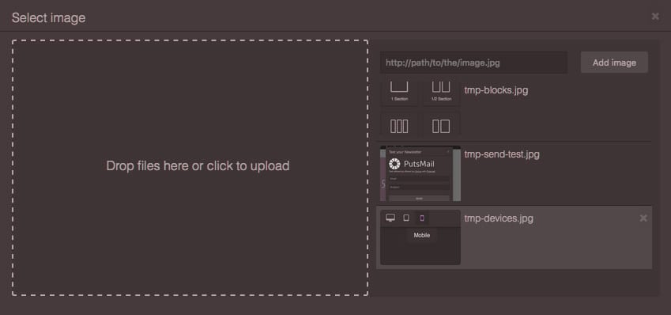
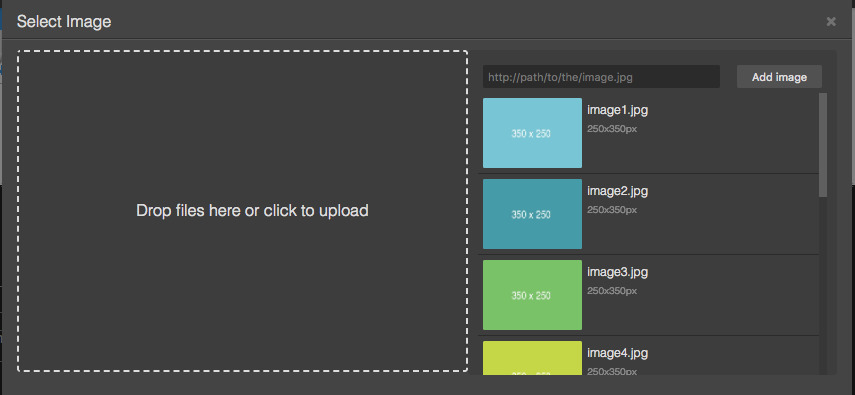
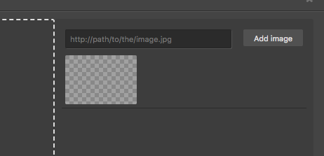
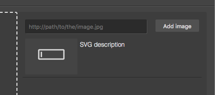
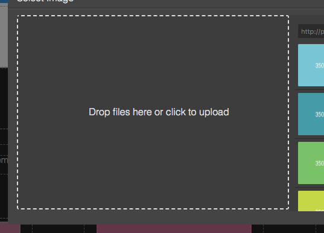
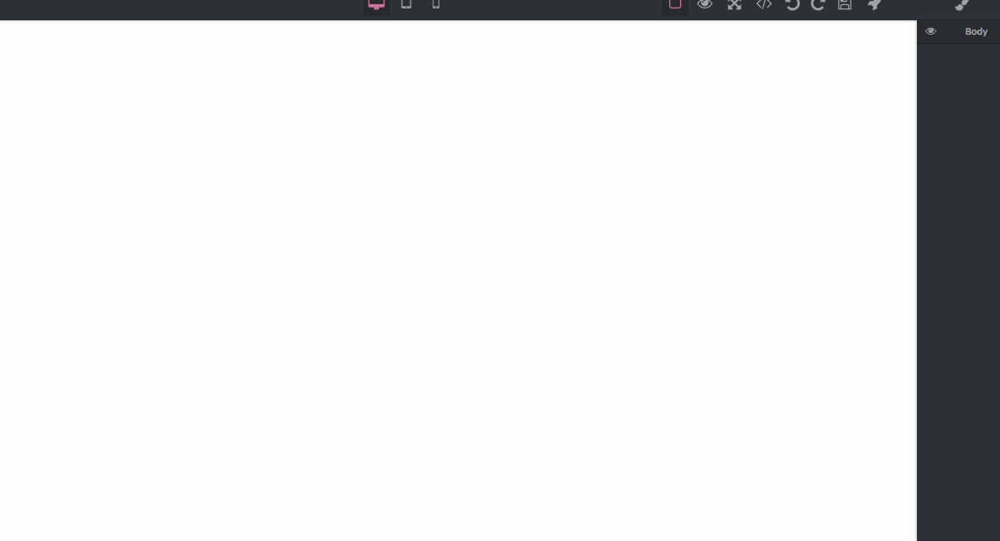

# 资源管理器



本节中，你将会看到如何设置和充分利用 GrapesJS 中内置的资源浏览器。资源浏览器非常轻量级，其核心功能仅仅实现了图片资源的管理，不过接下来你会看到资源管理器易于扩展以及创建自定义资源类型。

* [配置](#配置)
* [初始化](#初始化)
* [定制化](#定制化)
  * [定义新的资源类型](#定义新的资源类型)
  * [扩展资源类型](#扩展资源类型)
* [上传资源](#上传资源)
  * [监听器](#监听器)
  * [响应](#响应)
  * [设置可拖放区域](#设置可拖放区域)
* [事件](#事件)

## 配置

可在主要配置对象中传入 assetManager 属性来修改缺省的资源管理器配置

```js
const editor = grapesjs.init({
  ...
  assetManager: {
    assets: [...],
    ...
  }
});
```

你可以通过调用模块中的 getConfig 接口来修改大部分配置

```js
const amConfig = editor.AssetManager.getConfig();
```

以下是当前支持的配置列表

```js
  // Default assets
  // eg. [
  //  'https://...image1.png',
  //  'https://...image2.png',
  //  {type: 'image', src: 'https://...image3.png', someOtherCustomProp: 1},
  //  ..
  // ]
  assets: [],

  // Content to add where there is no assets to show
  // eg. 'No <b>assets</b> here, drag to upload'
  noAssets: '',

  // Upload endpoint, set `false` to disable upload
  // upload: 'https://endpoint/upload/assets',
  // upload: false,
  upload: 0,

  // The name used in POST to pass uploaded files
  uploadName: 'files',

  // Custom headers to pass with the upload request
  headers: {},

  // Custom parameters to pass with the upload request, eg. csrf token
  params: {},

  // The credentials setting for the upload request, eg. 'include', 'omit'
  credentials: 'include',

  // Allow uploading multiple files per request.
  // If disabled filename will not have '[]' appended
  multiUpload: true,

  // If true, tries to add automatically uploaded assets.
  // To make it work the server should respond with a JSON containing assets
  // in a data key, eg:
  // {
  //  data: [
  //    'https://.../image.png',
  //    ...
  //    {src: 'https://.../image2.png'},
  //    ...
  //  ]
  // }
  autoAdd: 1,

  // Text on upload input
  uploadText: 'Drop files here or click to upload',

  // Label for the add button
  addBtnText: 'Add image',

  // Custom uploadFile function
  // @example
  // uploadFile: (e) => {
  //   var files = e.dataTransfer ? e.dataTransfer.files : e.target.files;
  //   // ...send somewhere
  // }
  uploadFile: '',

  // Handle the image url submit from the built-in 'Add image' form
  // @example
  // handleAdd: (textFromInput) => {
  //   // some check...
  //   editor.AssetManager.add(textFromInput);
  // }
  handleAdd: '',

  // Enable an upload dropzone on the entire editor (not document) when dragging
  // files over it
  dropzone: 1,

  // Open the asset manager once files are been dropped via the dropzone
  openAssetsOnDrop: 1,

  // Any dropzone content to append inside dropzone element
  dropzoneContent: '',

  // Default title for the asset manager modal
  modalTitle: 'Select Image',
```

有时实现的代码会超前于文档，因此我们建议你查看相关的源码文件[资源管理器配置](https://github.com/artf/grapesjs/blob/dev/src/asset_manager/config/config.js)，以时刻关注配置参数的当前状态。

## 初始化

缺省情况下，资源管理器即可正常工作。传入一下 URL 来观察这些资源的加载。

```js
const editor = grapesjs.init({
  ...
  assetManager: {
    assets: [
     'http://placehold.it/350x250/78c5d6/fff/image1.jpg',
     // Pass an object with your properties
     {
       type: 'image',
       src: 'http://placehold.it/350x250/459ba8/fff/image2.jpg',
       height: 350,
       width: 250
     },
     {
       // As the 'image' is the base type of assets, omitting it will
       // be set as `image` by default
       src: 'http://placehold.it/350x250/79c267/fff/image3.jpg',
       height: 350,
       width: 250
     },
    ],
  }
});
```

当前支持的属性的完整列表详见[图片资源数据模型](https://github.com/artf/grapesjs/blob/dev/src/asset_manager/model/AssetImage.js)

内置的资源管理器模态窗已经实现按需显示。缺省情况下，向画布中拖入图片组件，双击图片或图片相关的其他元素即可弹出资源管理器模态窗（例如 CSS 样式窗）。



通过注册相关命令来提供资源管理器模态窗弹出功能，所以可以通过如下调用弹出模态窗：

```js
// This command shows only assets with `image` type
editor.runCommand('open-assets');
```

不过这样做并不能与资源进行交互（即使双击资源也什么都不会发生），这是由于并没有指明操作的对象。尝试选中画布中的图片，在控制台中执行如下脚本（你需要在脚本中确保编辑器对象挂在到了全局对象上 ***window.editor = editor***）

```js
editor.runCommand('open-assets', {
  target: editor.getSelected()
});
```

现在你可以改变组件的图片了。

## 定制化

如果想要在初始化之后定制化资源管理器，可以调用[资源管理器API](https://grapesjs.com/docs/api/assets.html)

```js
// Get the Asset Manager module first
const am = editor.AssetManager;
```

首先，资源管理器维护了两个资源集合：

* 全局集合 - 包含了所有可访问的资源，调用 ***em.getAll()*** 即可获取集合
* 可见集合 - 资源管理器当前渲染的资源集合，调用 ***am.getAllVisible()*** 即可获取集合

你可以自由决定显示哪些资源以及何时显示。假设有一个类别切换按钮，首先需要将所有资源添加到全局集合中（此前已由 ```config.assetManager.assets = [...]``` 定义）。

```js
am.add([
  {
    // You can pass any custom property you want
    category: 'c1',
    src: 'http://placehold.it/350x250/78c5d6/fff/image1.jpg',
  }, {
    category: 'c1',
    src: 'http://placehold.it/350x250/459ba8/fff/image2.jpg',
  }, {
    category: 'c2',
    src: 'http://placehold.it/350x250/79c267/fff/image3.jpg',
  }
  // ...
]);
```

此时调用 ***render()*** 方法，不传入任何参数，即可渲染全部资源。

```js
// without any argument
am.render();

am.getAll().length // <- 3
am.getAllVisible().length // <- 3
```

现在只渲染第一个类别下的资源。

```js
const assets = am.getAll();

am.render(assets.filter(
  asset => asset.get('category') == 'c1'
));

am.getAll().length // Still have 3 assets
am.getAllVisible().length // but only 2 are shown
```

也可以合并多个资源数组。

```js
am.render([...assets1, ...assets2, ...assets3]);
```

如果你想自定义资源管理器容器，你可以获取其 ```HTMLElement```

```js
am.getContainer().insertAdjacentHTML('afterbegin', '<div><button type="button">Click</button></div>');
```

更多API方法详见[资源管理器API参考手册](https://grapesjs.com/docs/api/assets.html)

### 定义新的资源类型

通常来说，图片并不是唯一支持的资源类型，资源类型可以是视频，SVG 图标，或是其他类型的文档。模板或页面中的每种资源类型实现方式都不同。如果想要改变组件的图片，只需要将 ```src``` 属性修改为需要的资源地址。然而如果是 SVG 图标，那么情况会有所不同，你需要将其替换为全新的 ```<svg>``` 内容。此外，你必须处理面板或弹窗中的资源的展示或预览。例如，为大图片显示缩略图或是预览视频。

定义新的资源意味着我们需要在"类型栈"顶部插入一个新的图层。编辑器会在插入新的资源时遍历这个栈，并且尝试将该资源关联到正确的类型。

```js
am.add('https://.../image.png');
// string, url, ends with '.png' -> it's an 'image' type

am.add('<svg ...');
// string and starts with '<svg...' -> 'svg' type

am.add({type: 'video', src: '...'});
// an object, has 'video' type key -> 'video' type
```

编辑器如何识别新的资源类型完全由你决定，你需要提供 ```isType()``` 方法。以下是定义新资源类型 ```svg-icon``` 的示例

```js
am.addType('svg-icon', {
  // `value` is for example the argument passed in `am.add(VALUE);`
  isType(value) {
    // The condition is intentionally simple
    if (value.substring(0, 5) == '<svg ') {
      return {
        type: 'svg-icon',
        svgContent: value
      };
    }
    // Maybe you pass the `svg-icon` object already
    else if (typeof value == 'object' && value.type == 'svg-icon') {
      return value;
    }
  }
})
```

上述代码定义了 SVG 类型，资源管理器会为其赋予合适的类型。

```js
// Add some random SVG
am.add(`<svg viewBox="0 0 24 24" xmlns="http://www.w3.org/2000/svg">
  <path d="M22,9 C22,8.4 21.5,8 20.75,8 L3.25,8 C2.5,8 2,8.4 2,9 L2,15 C2,15.6 2.5,16 3.25,16 L20.75,16 C21.5,16 22,15.6 22,15 L22,9 Z M21,15 L3,15 L3,9 L21,9 L21,15 Z"></path>
  <polygon points="4 10 5 10 5 14 4 14"></polygon>
</svg>`);
```

默认的 ```open-assets``` 命令只渲染图片类型的资源，想要渲染 ```svg-icon``` 类型的资源可以调用

```js
am.render(am.getAll().filter(
  asset => asset.get('type') == 'svg-icon'
));
```

结果如下



SVG 资源并没有正确渲染，这是因为还没有为其定义视图。

```js
am.addType('svg-icon', {
  view: {
    // `getPreview()` and `getInfo()` are just few helpers, you can
    // override the entire template with `template()`
    // Check the base `template()` here:
    // https://github.com/artf/grapesjs/blob/dev/src/asset_manager/view/AssetView.js
    getPreview() {
      return `<div style="text-align: center">${this.model.get('svgContent')}</div>`;
    },
    getInfo() {
      // You can use model's properties if you passed them:
      // am.add({
      //  type: 'svg-icon',
      //  svgContent: '<svg ...',
      //  name: 'Some name'
      //  })
      //  ... then
      //  this.model.get('name');
      return '<div>SVG description</div>';
    },
  },
  isType(value) {...}
})
```

结果如下



接下来将 ```svgContent``` 属性赋值给选中的组件

```js
am.addType('svg-icon', {
  view: {
    // In our case the target is the selected component
    updateTarget(target) {
      const svg = this.model.get('svgContent');

      // Just to make things bit interesting, if it's an image type
      // I put the svg as a data uri, content otherwise
      if (target.get('type') == 'image') {
        // Tip: you can also use `data:image/svg+xml;utf8,<svg ...` but you
        // have to escape few chars
        target.set('src', `data:mime/type;base64,${btoa(svg)}`);
      } else {
        target.set('content', svg);
      }
    },
    ...
  },
  isType(value) {...}
})
```

自定义的 ```svg-icon``` 资源已经可用了。你也可以在 ```addType``` 参数中增加 ```model``` 属性，将商业逻辑整合到资源中，不过这并不是强制的。

```js
// Just an example of model use
am.addType('svg-icon', {
  model: {
    // With `default` you define model's default properties
    defaults: {
      type:  'svg-icon',
      svgContent: '',
      name: 'Default SVG Name',
    },

    // You can call model's methods inside views:
    // const name = this.model.getName();
    getName() {
      return this.get('name');
    }
  },
  view: {...},
  isType(value) {...}
})
```

### 扩展资源类型

扩展资源类型与新增资源类型同样简单，你可以选择扩展何种类型的资源，以及如何扩展它。

```js
// svgIconType will contain the definition (model, view, isType)
const svgIconType = am.getType('svg-icon');

// Add new type and extend another one
am.addType('svg-icon2', {
  view: svgIconType.view.extend({
    getInfo() {
      return '<div>SVG2 description</div>';
    },
  }),
  // The `isType` is important, but if you omit it the default one will be added
  // isType(value) {
  //  if (value && value.type == id) {
  //    return {type: value.type};
  //  }
  // };
})
```

你同样可以扩展已经定义好的资源类型（为你的定义创建一个插件，以便正确完整地加载待扩展的资源）。

```js
// Extend the original `image` and add a confirm dialog before removing it
am.addType('image', {
  // As you adding on top of an already defined type you can avoid indicating
  // `am.getType('image').view.extend({...` the editor will do it by default
  // but you can eventually extend some other type
  view: {
    // If you want to see more methods to extend check out
    // https://github.com/artf/grapesjs/blob/dev/src/asset_manager/view/AssetImageView.js
    onRemove(e) {
      e.stopPropagation();
      const model = this.model;

      if (confirm('Are you sure?')) {
        model.collection.remove(model);
      }
    }
  },
})
```

## 上传资源

资源管理器提供了一个易用且可拖拽的包含一系列UI辅助工具的文件上传器。缺省情况下，打开资源管理器即可看到文件上传器。



点击文件上传器选择文件或将其直接从本机拖入即可触发上传。显然，你需要事先配置好接收资源的服务器，并且在配置中指定上传的终端地址。

```js
let editor = grapesjs.init({
  ...
  assetManager: {
    ...
    // Upload endpoint, set `false` to disable upload, default `false`
    upload: 'https://endpoint/upload/assets',

    // The name used in POST to pass uploaded files, default: `'files'`
    uploadName: 'files',
    ...
  },
  ...
});
```

### 监听器

如果想要在上传文件过程触发前或完成后，或者上传完成并收到响应后，执行一些操作（例如加载上传动画），可以利用如下监听器

```js
// The upload is started
editor.on('asset:upload:start', () => {
  ...
  startAnimation();
});

// The upload is ended (completed or not)
editor.on('asset:upload:end', () => {
  ...
  endAnimation();
});

// Error handling
editor.on('asset:upload:error', (err) => {
  ...
  notifyError(err);
});

// Do something on response
editor.on('asset:upload:response', (response) => {
  ...
});
```

### 响应

缺省情况下（传入 ```autoAdd: 1```），当上传完成后，编辑器等待接收一个包含 ```data``` 属性 JSON 对象作为响应，同时尝试 ```data``` 属性中的数据加入到主要集合中。JSON 的格式如下：

```js
{
  data: [
    'https://.../image.png',
    // ...
    {
      src: 'https://.../image2.png',
      type: 'image',
      height: 100,
      width: 200,
    },
    // ...
  ]
}
```

### 设置拖放区域

以下是一个提升上传资源交互体验的辅助工具：一个全屏宽度的可拖放区域



你只需要激活它同时设置它的内容（你也可能想要隐藏缺省的文件上传器）

```js
const editor = grapesjs.init({
  ...
  assetManager: {
    ...,
    dropzone: 1,
    dropzoneContent: '<div class="dropzone-inner">Drop here your assets</div>'
  }
});
```

## 事件

当前支持的事件列表如下

* ```asset:add``` - 添加新的资源类型
* ```asset:remove``` - 删除资源类型
* ```asset:upload:start``` - 资源上传开始前
* ```asset:upload:end``` - 资源上传结束后
* ```asset:upload:error``` - 资源上传出错, 参数为错误数据对象
* ```asset:upload:response``` - 资源上传结束收到响应后, 参数为响应数据对象
