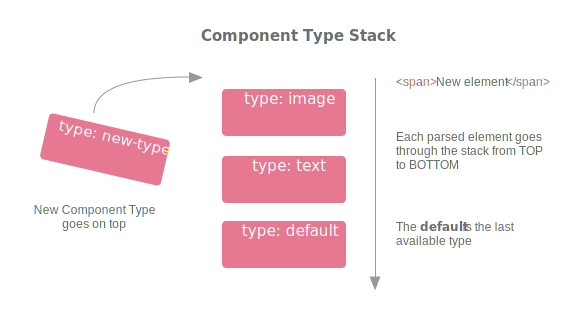

# 组件管理器

组件是模板的基本元素。组件可以是简单且原子化的事物，如一张图片或是一个文本盒子，不过也可以是较为复杂的结构，可能由若干个其他组件组成，如区块或者页面。组件概念的提出使得开发者能够为不同的元素绑定不同的行为。举例来说，通过双击图片打开资源管理器就是一种绑定到特定类型的元素上的自定义行为。

> 警告

> 本指南基于 Grapesjs v0.15.8 及以上版本

* [组件是如何工作的？](#组件是如何工作的？)
  * [组件定义](#组件定义)
  * [组件识别及组件类型栈](#组件识别及组件类型栈)
  * [组件实例](#组件实例)
  * [组件渲染](#组件渲染)
* [内置组件类型](#内置组件类型)
* [定义定制化组件类型](#定义定制化组件类型)
  * [```isComponent```](#isComponent)
  * [模型](#模型)
  * [视图](#视图)
* [更新组件类型](#更新组件类型)
  * [扩展组件类型](#扩展组件类型)
  * [扩展父级方法](#扩展父级方法)
* [生命周期钩子函数](#生命周期钩子函数)
* [组件与JavaScript脚本](#组件与javascript)
* [提示](#提示)
  * [JSX 语法](#jsx-语法)

## 组件是如何工作的？

让我们从向编辑器加入一段 HTML 字符串开始，跟踪整个过程来了解组件是如何工作的。

> 提示

> [主要示例](https://grapesjs.com/demo.html)中的代码片段都可以直接在浏览器控制台中运行

以下是向画布中添加新的组件的方法：

```js
// Append components directly to the canvas
editor.addComponents(`<div>
  
  <span title="foo">Hello world!!!</span>
</div>`);

// or into some, already defined, component.
// For instance, appending to a selected component would be:
editor.getSelected().append(`<div>...`);

// Actually, editor.addComponents is an alias of...
editor.getWrapper().append(`<div>...`);
```

> 提示

> 如果想要在特定位置插入组件，可以使用```at```选项。因此，如果想要在所有组件（处于同一集合中）之前插入组件，可以如下调用：
>```js
>   component.append('<div>...', { at: 0 })
>```
> 或者将组件插入中间的某个位置
>```js
>   const { length } = component.components();
>   component.append('<div>...', { at: parseInt(length / 2, 10) })
>```

## 组件定义

首先，HTML 字符串会被解析和转换成所谓的“组件定义”，所以上述代码的结果如下：

```js
{
  tagName: 'div',
  components: [
    {
      type: 'image',
      attributes: { src: 'https://path/image' },
    }, {
      tagName: 'span',
      type: 'text',
      attributes: { title: 'foo' },
      components: [{
        type: 'textnode',
        content: 'Hello world!!!'
      }]
    }
  ]
}
```

真实的```组件定义```是一个比上述对象稍大的对象，为了简单起见，我们简化了这个 JSON 对象。

你可能已经注意到，上述结果与通常所说的**虚拟DOM**类似，是 DOM 元素的轻量级表示。实际上，这有助于编辑器跟踪元素的状态，并做出高性能的改变或更新。向```tagName```，```attributes```和```components```这些属性的定义是显而易见的，那么什么是```类型```呢？这个特别的属性指明了**组件定义**中的**组件类型**（缺省的组件列表[如下](#内置组件类型)），而且如果其被省略，缺省的组件类型会是```type: 'default'```。由此，一个值得讨论的问题是，编辑器如何从一个简单的 HTML 字符串出发来给组件赋予类型？这一步骤就是**组件识别**，稍后会详细阐述。

## 组件识别及组件类型栈

如上所述，当向编辑器传入一个 HTML 字符串时，该字符串被解析和编译成具有```type```属性的[组件定义](#组件定义)对象。为了识别出每个编译好的 HTML 元素应该被赋予何种类型，编辑器会遍历所有已经定义的组件，这些组件构成了**组件类型栈**，通过调用```isComponent```方法（稍后详述）来判断元素是否属于某个组件类型。组件类型栈是一个简单的组件类型数组，不过其中的顺序至关重要。任何新加入的组件类型（稍后会阐述如何创建新的组件类型）都会出现在组件类型栈的顶部，每一个从解析器返回的元素都会自顶向下遍历组件类型栈（栈底最后一个元素即为```default```类型），直至```isComponent```方法在遍历到栈中某个组件时返回真值。



> 提示

> 如果你正导入一大段 HTML 代码，你也许会希望跳过解析过程，同时通过直接传入一个组件定义对象或是使用 JSX 语法来提升性能。[这里](#安装JSX语法解析器)详述了如何安装一个 JSX 语法解析器。

## 组件实例

在组件定义就绪并且赋予了类型后，[组件](https://grapesjs.com/docs/api/component.html) 实例（即为**模型**）就创建出来了。让我们回顾之前的 HTML 字符串的示例，```append```方法的返回值是一个包含新增组件的数组。

```js
const component = editor.addComponents(`<div>
  
  <span title="foo">Hello world!!!</span>
</div>`)[0];
```

组件实例包括可用于读取和修改其数据的属性和方法。你可以调用```get```方法来读取属性，比如```type```属性。

```js
const componentType = component.get('type'); // eg. 'image'
```

调用```set```方法来修改属性，这可能会改变组件在画布中的展示和行为。

```js
// Make the component not draggable
component.set('draggable', false);
```

其他可用方法还有```getAttributes```，```setAttributes```，```components```等等。

```js
const innerComponents = component.components();
innerComponents.forEach(comp => console.log(comp.toHTML()));
// Update component content
component.components(`<div>Component 1</div><div>Component 2</div>`);
```

每个组件都可以定义独有的属性和方法，但是全部的属性和方法都会被继承，至少```default```类型组件的属性和方法会被继承（稍后详述如何新建自定义组件以及如何扩展已定义组件），因此在[组件API](https://grapesjs.com/docs/api/component.html#component)页面查看全部可用的属性和方法是个好办法。

组件的主要目标是跟踪组件数据，并且在需要时返回组件数据。需要展示组件当前的 HTML 时，可以如下调用：

```js
const componentHTML = component.toHTML();
```

上述代码返回一个包含组件本身及其子孙节点的 HTML 的字符串。组件对象实现了```toJSON```方法，如下获取组件的 JSON 结构

```js
JSON.stringify(component)
```

> 提示

> [存储管理器](https://grapesjs.com/docs/modules/Storage.html)阐述了如何获取和保存所有组件

因此，**组件实例**负责管理模板的**静态数据**（例如 HTML，JSON）。例如，如果需要在 HTML 中更新或者新增属性，你需要更新组件（例如，```component.addAttributes({ title: 'Title added' })```）。组件或者说模型才是核心。

## 组件渲染

组件的另一个重要组成部分是如何在画布中渲染，这方面由组件的**视图**负责。视图与**静态 HTML 数据**无关，你可以返回一个形如```<div>...</div>```的 HTML 大字符串，在画布中作为一个简单图片来渲染（就像是复杂或者动态数据的文本占位符）。

缺省情况下，组件的视图是与其模型数据自动同步的（不存在一个没有模型的视图）。当更新组件的属性或者在组件中新增属性时，画布中的视图就会更新。

然而，有时你可能会需要增加额外的逻辑来处理组件的结果。当用户想要构建其```<table>```元素时，你可能需要在画布中添加一个自定义按钮，以便于用户可以很方便地新增或删除某一行或某一列。你可以利用视图实现来添加额外的 DOM 元素，监听事件，等等。这一切操作都与```<table>```组件的静态 HTML（用户期望得到的结果） 完全无关，因为这些操作由模型管理。一旦组件渲染完成，其视图和 DOM 元素便可随时访问。

```js
const component = editor.getSelected();
// Get the View
const view = component.getView();
// Get the DOM element
const el =  component.getEl();
```

通常来说，你不需要修改视图，因为缺省视图已经处理视图与模型自动同步的逻辑关系。不过，当你需要完全控制元素（例如，自定义交互界面）时，你很可能需要创建一个自定义组件类型，同时用你自己的逻辑来扩展它的视图。稍后详述如何创建自定义组件类型。

目前为止我们已经了解了组件的核心概念及其工作原理。模型或组件是模板静态代码的唯一数据来源（例如，导出 HTML 功能就是来自这一数据来源），同时视图或者说组件视图是编辑器用来在画布中预览组件的。

## 内置组件类型

以下列出了内置组件类型，按组件类型栈中的位置排序

* [cell](https://github.com/artf/grapesjs/blob/dev/src/dom_components/model/ComponentTableCell.js)- 处理```<td>```和```<th>```元素的组件

* [row](https://github.com/artf/grapesjs/blob/dev/src/dom_components/model/ComponentTableRow.js)- 处理```<tr>```的组件

* [table](https://github.com/artf/grapesjs/blob/dev/src/dom_components/model/ComponentTable.js)- 处理```<table>```的组件

* [thead](https://github.com/artf/grapesjs/blob/dev/src/dom_components/model/ComponentTableHead.js)- 处理```<thead>```的组件

* [tbody](https://github.com/artf/grapesjs/blob/dev/src/dom_components/model/ComponentTableBody.js)- 处理```<tbody>```的组件

* [tfoot](https://github.com/artf/grapesjs/blob/dev/src/dom_components/model/ComponentTableFoot.js)- 处理```<tfoot>```的组件

* [map](https://github.com/artf/grapesjs/blob/dev/src/dom_components/model/ComponentMap.js)- 处理```<a>```的组件

* [link](https://github.com/artf/grapesjs/blob/dev/src/dom_components/model/ComponentLink.js)- 处理```<a>```的组件

* [label](https://github.com/artf/grapesjs/blob/dev/src/dom_components/model/ComponentLabel.js)- 处理```<label>```的组件

* [video](https://github.com/artf/grapesjs/blob/dev/src/dom_components/model/ComponentVideo.js)- 处理```<videos>```的组件

* [image](https://github.com/artf/grapesjs/blob/dev/src/dom_components/model/ComponentImage.js)- 处理```<images>```的组件

* [script](https://github.com/artf/grapesjs/blob/dev/src/dom_components/model/ComponentScript.js)- 处理```<script>```的组件

* [svg](https://github.com/artf/grapesjs/blob/dev/src/dom_components/model/ComponentSvg.js)- 处理 SVG 的组件

* [comment](https://github.com/artf/grapesjs/blob/dev/src/dom_components/model/ComponentComment.js)- 处理注释的组件

* [textnode](https://github.com/artf/grapesjs/blob/dev/src/dom_components/model/ComponentTextNode.js)- 类似于 DOM 定义中的```textnode```

* [text](https://github.com/artf/grapesjs/blob/dev/src/dom_components/model/ComponentText.js)- 可内联编辑的文本组件

* [wrapper](https://github.com/artf/grapesjs/blob/dev/src/dom_components/model/ComponentWrapper.js)- 画布中必需的根组件，一个包装器

* [default](https://github.com/artf/grapesjs/blob/dev/src/dom_components/model/Component.js)- 缺省组件

## 定义定制化组件类型

现在我们知道了组件的工作原理，接下来我们来探索如何创建**自定义组件类型**。

定义新的组件类型的第一步就是将代码放入一个[“插件”](#定义自定义组件类型)中，如果想要在所有组件初始化之前加载自定义组件类型（例如，从数据库中加载模板），这一步就是必要的。插件会在所有组件加载前完成加载（例如使用存储），所以插件是定义组件类型的最佳工具。

```js
const myNewComponentTypes = editor => {
  editor.DomComponents.addType(/* API for component type definition */);
};

const editor = grapesjs.init({
  container : '#gjs',
  // ...
  plugins: [ myNewComponentTypes ],
});
```

下例中我们要让编辑器能够识别并更好地处理```<input>```元素。

```js
editor.DomComponents.addType('my-input-type', {
  // Make the editor understand when to bind `my-input-type`
  isComponent: el => el.tagName === 'INPUT',

  // Model definition
  model: {
    // Default properties
    defaults: {
      tagName: 'input',
      draggable: 'form, form *', // Can be dropped only inside `form` elements
      droppable: false, // Can't drop other elements inside
      attributes: { // Default attributes
        type: 'text',
        name: 'default-name',
        placeholder: 'Insert text here',
      },
      traits: [
        'name',
        'placeholder',
        { type: 'checkbox', name: 'required' },
      ],
    }
  }
});
```

有了上述代码，编辑器就能够识别并处理简单的文本输入组件```<input>```，赋予其缺省的属性，更好地显示其特性。

> 提示

> 特性（Traits）的原理详见[特性文档](https://grapesjs.com/docs/modules/Traits.html)，建议在阅读完本文档后再进行阅读。

## isComponent

综上所述，```isComponent```方法是我们了解到的第一个概念，我们已经介绍过其[使用方法](#组件识别及组件类型栈)，我们需要利用它来使编辑器能够在组件识别阶段正确识别```<input>```组件。该方法只接收```el```参数，即解析后的 HTMLElement 节点，并且当元素符合你的逻辑条件时，返回一个真值。如下所示，将一个段 HTML 字符串作为组件添加到编辑器中

```js
// ...after editor initialization
editor.addComponents(`<input name="my-test" title="hello"/>`)
```

由此生成组件定义

```js
{
  type: 'my-input-type',
  attributes: {
    name: 'my-test',
    title: 'hello',
  },
}
```

如果需要，你也可以返回自定义组件定义对象：

```js
editor.DomComponents.addType('my-input-type', {
  isComponent: el => {
    if (el.tagName === 'INPUT') {
      // You should explicitly declare the type of your resultant
      // object, otherwise the `default` one will be used
      const result = { type: 'my-input-type' };

      if (/* some other condition */) {
        result.attributes = { title: 'Hi' };
      }

      return result;
    }
  },
  // ...
});
```

> 警告

> 尽量保持```isComponent```方法简单

需要注意的是，该方法可能接收到任何来自画布的解析后的元素（例如当读取或添加组件时），然而并不是所有的节点都具有同样的接口（如属性或者方法）。如下：

```js
// ...
// Print elements
isComponent: el => {
    console.log(el);
    return el.tagName === 'INPUT';
},

// ...
editor.addComponents(`<div>
  I'm a text node
  <!-- I'm a comment node -->
  
  <input/>
</div>`);
```

将会输出所有的节点信息，所以当在```isComponent```中调用```el.getAttribute('...')```（```div```节点有此方法但是```textnode```节点没有）时，如果检查不当，将会中断代码的执行。

另一件同样重要的事是，```isComponent```只有在解析过程必须执行时才会调用（例如将 HTML 字符串作为组件添加到画布中或者通过调用```fromElement```方法初始化编辑器）。如果组件类型事先已经定义好，就没有必要调用```isComponent```方法了。如下所示：

```js
// isComponent will be executed on some-element
editor.addComponents('<some-element>...</some-element>');

// isComponent WON'T be executed on OBJECTS
// If the object has no `type` key, the `default` one will be used
editor.addComponents({
  type: 'some-component',
});

// isComponent WON'T be executed as we're forcing the type
editor.addComponents('<some-element data-gjs-type="some-component">...');
```

定义组件类型时，如果没有调用```isComponent```，编辑器能够识别该组件的唯一方法就是显式地声明该类型（在入参中定义type属性```{ type: ... }```或者使用```data-gjs-type```属性）。

## 模型

在了解```isComponent```原理后，接下来我们阐述```model```属性。模型可能是用得最多的，用于描述组件，同时你最先能够看到的就是它的缺省字段，这些字段代表了缺省的组件属性，模型与已定义的组件定义相对应。

模型同时也定义了 HTML。你可能已经了解了```tagName```（缺省为```div```）和模型上属性的使用方法。

另一个重要的属性（```<input/>```不需要它所以前述未提及）就是```components```，该属性定义了内部组件。

```js
defaults: {
  tagName: 'div',
  attributes: { title: 'Hello' },
  // Can be a string
  components: `
    <h1>Header test</h1>
    <p>Paragraph test</p>
  `,
  // A component definition
  components: {
    tagName: 'h1',
    components: 'Header test',
  },
  // Array of strings/component definitions
  components: [
    {
      tagName: 'h1',
      components: 'Header test',
    },
    '<p>Paragraph test</p>',
  ],
  // Or a function, which get as an argument the current
  // model and expects as the return one of the possible
  // values described above
  components: model => {
    return `<h1>Header test: ${model.get('type')}</h1>`;
  },
}
```

### 读取及更新模型数据

只要获取到模型属性的引用，就可以随时读取和修改它们。以下展示了最常用的API

```js
// let's use the selected component
const modelComponent = editor.getSelected();

// Get all the model properties
const props = modelComponent.props();

// Get a single property
const tagName = modelComponent.get('tagName');

// Update a single property
modelComponent.set('tagName', '...');

// Update multiple properties
modelComponent.set({
  tagName: '...',
  // ...
});


// Some helpers

// Get all attributes
const attrs = modelComponent.getAttributes();

// Add attributes
modelComponent.addAttributes({ title: 'Test' });

// Replace all attributes
modelComponent.setAttributes({ title: 'Test' });

// Get the collection of all inner components
modelComponent.components().forEach(
  inner => console.log(inner.props())
);

// Update the inner content with an HTML string/Component Definitions
const addedComponents = modelComponent.components(`<div>...</div>`);

// Find components by query string
modelComponent.find(`.query-string[example=value]`).forEach(
  inner => console.log(inner.props())
);
```

一旦修改模型，画布中的组件及其导出的代码都会同步更新。

> 提示

> 全部可用API详见[组件API页面](https://grapesjs.com/docs/api/component.html)

### 监听属性变化

如果需要在属性发生改变时完成一系列动作，你可以在初始化方法中添加监听器

```js
editor.DomComponents.addType('my-input-type', {
  // ...
  model: {
    defaults: {
      // ...
      someprop: 'initial value',
    },

    init() {
      this.on('change:someprop', this.handlePropChange);
      // Listen to any attribute change
      this.on('change:attributes', this.handleAttrChange);
      // Listen to title attribute change
      this.on('change:attributes:title', this.handleTitleChange);
    },

    handlePropChange() {
      const { someprop } = this.props();
      console.log('New value of someprop: ', someprop);
    },

    handleAttrChange() {
      console.log('Attributes updated: ', this.getAttributes());
    },

    handleTitleChange() {
      console.log('Attribute title updated: ', this.getAttributes().title);
    },
  }
});
```

[后面的章节](#生命周期钩子函数)列出了可用的生命周期方法，如```init```。

让我们回顾一下输入组件交互，看看组件定制化中的另一个重要的部分

## 视图

通常来说，当使用 GrapesJS 创建一个组件时，你可能会想要在画布中看到模型中的定义。事实上，缺省情况下，编辑器提供这个机制，并且在模型有变动（例如```attributes```，```tag```等等）时更新画布中的组件，以此来实现所见即所得的体验。然而，并不是所有简单的事情都正确，给建造器创建组件时，你会发现有时你需要做一些其他的事情：

* 你希望提升组件编辑的体验。最典型的例子是```TextComponent```，内置的富文本编辑器扩展了它的视图，以便用户可以通过双击来更快地修改文本内容。所以你可能会感觉需要围绕组件增加一些动作来响应 DOM 事件或者干脆自定义元素UI。

* 组件 DOM 的呈现与预期不同，因此你需要改变一些组件行为。举例来说，一个视频组件```VideoComponent```通过 iframe 加载 Youtube 页面。当 iframe 加载完成，其内部的一切都处在一个完全不同的上下文中，编辑器无法感知，实际上如果你使用鼠标点击 iframe，你将会与视频组件进行交互而不是编辑器，所以你甚至无法选中这个视频组件。为了解决这个问题，在渲染中，我们不支持鼠标与 iframe 的点击交互，同时将其封装成另一个组件（如果没有封装器，编辑器将会选中父组件）。显然，这些修改与最终的代码无关，结果始终是一个简单的 iframe

* 你需要定制化内容或者用服务端返回的数据来填充它

针对上述场景，你可以使用组件类型定义中的视图。```<input>```组件并不是最适用于这样的场景，但我们将会尝试通过下面的示例满足大部分场景的需求

```js
editor.DomComponents.addType('my-input-type', {
  // ...
  model: {
    // ...
  },
  view: {
    // Be default, the tag of the element is the same of the model
    tagName: 'div',

    // Add easily component specific listeners with `events`
    // Being component specific (eg. you can't attach here listeners to window)
    // you don't need to care about removing them when the component is removed,
    // they will be managed automatically by the editor
    events: {
      click: 'clickOnElement',
      // You can also make use of event delegation
      // and listen to events bubbled from some inner element
      'dblclick .inner-el': 'innerElClick',
    },

    innerElClick(ev) {
      ev.stopPropagation();
      // ...

      // If you need you can access the model from any function in the view
      this.model.components('Update inner components');
    },

    // On init you can create listeners, like in the model, or start some other
    // function at the beginning
    init({ model }) {
      // Do something in view on model property change
      this.listenTo(model, 'change:prop', this.handlePropChange);

      // If you attach listeners on outside objects remember to unbind
      // them in `removed` function in order to avoid memory leaks
      this.onDocClick = this.onDocClick.bind(this);
      document.addEventListener('click', this.onDocClick)
    },

    // Callback triggered when the element is removed from the canvas
    removed() {
      document.removeEventListener('click', this.onDocClick)
    },

    // Do something with the content once the element is rendered.
    // The DOM element is passed as `el` in the argument object,
    // but you can access it from any function via `this.el`
    onRender({ el }) {
      const btn = document.createElement('button');
      btn.value = '+';
      // This is just an example, AVOID adding events on inner elements,
      // use `events` for these cases
      btn.addEventListener('click', () => {});
      el.appendChild(btn);
    },

    // Example of async content
    async onRender({ el, model }) {
      const asyncContent = await fetchSomething({
        someDataFromModel: model.get('someData'),
      });
      // Remember, these changes exist only inside the editor canvas
      // None of the DOM change is stored in your template data,
      // if you need to store something, update the model properties
      el.appendChild(asyncContent);
    }
  },
});
```

## 更新组件类型

更新组件类型是非常容易的事情，如下所示：

```js
const domc = editor.DomComponents;

domc.addType('some-component', {
  // You can update the isComponent logic or leave the one from `some-component`
  // isComponent: (el) => false,

  // Update the model, if you need
  model: {
    // The `defaults` property is handled differently
    // and will be merged with the old `defaults`
    defaults: {
      tagName: '...', // Overrides the old one
      someNewProp: 'Hello', // Add new property
    },
    init() {
      // Ovverride `init` function in `some-component`
    }
  },

  // Update the view, if you need
  view: {},
});
```

### 扩展组件类型

有时你需要通过扩展一种组件类型来创建新的组件类型。只需要使用```extend```和```extendView```方法来扩展指定的组件。

```js
comps.addType('my-new-component', {
  isComponent: el => {/* ... */},
  extend: 'other-defined-component',
  model: { ... }, // Will extend the model from 'other-defined-component'
  view: { ... }, // Will extend the view from 'other-defined-component'
});
```

```js
comps.addType('my-new-component', {
  isComponent: el => {/* ... */},
  extend: 'other-defined-component',
  model: { ... }, // Will extend the model from 'other-defined-component'
  extendView: 'other-defined-component-2',
  view: { ... }, // Will extend the view from 'other-defined-component-2'
});
```

### 扩展父级方法

当需要重用来自父级的方法时，尽量避免如下写法：

```js
domc.getType('parent-type').model.prototype.init.apply(this, arguments);
```

使用```extendFn```和```extendFnView```方法：

```js
domc.addType('new-type', {
  extend: 'parent-type',
  extendFn: ['init'], // array of model functions to extend from `parent-type`
  model: {
    init() {
      // do something
    },
  }
});
```

> 提示

> 如果需要，可以通过如下调用获取所有组件类型

> ```js
> editor.DomComponents.getTypes().forEach(compType => console.log(compType.id))
> ```

## 生命周期钩子函数

每个组件都会触发独有的生命周期钩子函数，可以在组件加载的特定时期增加自定义行为。全局钩子和局部钩子是两种不同的钩子函数。你可以在创建或者扩展一个组件类型时（通常通过调用模型或者视图方法实现）定义局部钩子函数，以便使特定的组件类型响应指定的事件。而全局钩子会在全部组件上隐式调用（通过调用```editor.on```监听事件），你可以利用全局钩子来满足通用的使用场景或者在另一些组件中监听全局钩子。

以下列出了全部的钩子：

* **局部钩子**： ```model.init()```方法，在组件的模型初始化时执行
* **全局钩子**： ```component:create```事件，在```model.init()```后触发。回调函数接收组件模型作为入参。示例：```editor.on('component:create', model => console.log('created', model))```
* **局部钩子**： ```view.init()```方法，在组件的视图初始化时执行
* **局部钩子**： ```view.onRender()```方法，当组件在画布中渲染时执行
* **全局钩子**： ```component:mount```事件，在```view.onRender()```后触发。回调函数接收组件模型作为入参。
* **局部钩子**： ```model.updated()```方法，在修改模型的属性时执行。
* **全局钩子**： ```component:update```事件，在```model.updated()```后触发。回调函数接收组件模型作为入参。使用```component:update:{propertyName}```可以监听指定的属性变化事件。
* **局部钩子**： ```model.removed()```方法，在删除组件时执行。
* **全局钩子**： ```component:remove```事件，在```model.removed()```后触发。回调函数接收组件模型作为入参。

以下列出了全部的钩子使用示例：

```js
editor.DomComponents.addType('test-component', {
  model: {
    defaults: {
      testprop: 1,
    },
    init() {
      console.log('Local hook: model.init');
      this.listenTo(this, 'change:testprop', this.handlePropChange);
      // Here we can listen global hooks with editor.on('...')
    },
    updated(property, value, prevValue) {
      console.log('Local hook: model.updated',
        'property', property, 'value', value, 'prevValue', prevValue);
    },
    removed() {
      console.log('Local hook: model.removed');
    },
    handlePropChange() {
      console.log('The value of testprop', this.get('testprop'));
    }
  },
  view: {
    init() {
      console.log('Local hook: view.init');
    },
    onRender() {
      console.log('Local hook: view.onRender');
    },
  },
});

// A block for the custom component
editor.BlockManager.add('test-component', {
  label: 'Test Component',
  content: '<div data-gjs-type="test-component">Test Component</div>',
});

// Global hooks
editor.on(`component:create`, model => console.log('Global hook: component:create', model.get('type')));
editor.on(`component:mount`, model => console.log('Global hook: component:mount', model.get('type')));
editor.on(`component:update:testprop`, model => console.log('Global hook: component:update:testprop', model.get('type')));
editor.on(`component:remove`, model => console.log('Global hook: component:remove', model.get('type')));
```

## 组件与JavaScript

了解更多创建附带 javascript 脚本的组件的方法（例如 计数器，画廊，幻灯片，等等），详见页面[组件与JavaScript](./4.组件与JavaScript.md)

## 提示

### JSX 语法

在向编辑器中引入一大段 HTML 字符串（例如通过模块定义的）时，JSX 会是性能和代码可读性之间的一个很棒的折中选择，它通过保留 HTML 语法来跳过组件解析和组件识别过程。缺省情况下，GrapesJS 能够识别使用 React JSX 定义的对象。因此，如果你使用 React 进行开发，那么你已经在使用 JSX，这已经足够了，你的开发环境能够解析 javascript 文件中的 JSX 代码。

因此不建议如此使用：

```js
// I'm adding a string, so the parsing and the component recognition steps will be executed
editor.addComponents(`<div>
  <span data-gjs-type="custom-component" data-gjs-prop="someValue" title="foo">
    Hello!
  </span>
</div>`);
```

同样不建议：

```js
// I'm passing the Component Definition, so heavy steps will be skipped but the code is less readable
editor.addComponents({
  tagName: 'div',
  components: [
    {...}
  ],
});
```

建议写法：

```js
editor.addComponents(<div>
  <custom-component data-gjs-prop="someValue" title="foo">
    Hello!
  </custom-component>
</div>);
```

使用 JSX 语法的另一个好处是，可以将组件类型作为组件的标签```<custom-component>```，替代```data-gjs-type="custom-component"```

### 配置 JSX 语法

对于不使用 React 的开发者来说，有下列可选的配置参数：

* GrapesJS 有一个名为```config.domComponents.processor```的配置参数，使用它可以很容易地支持其他的 JSX 预设。这在使用不同于 React 的框架但仍然使用 JSX 开发时很有用（例如使用 Vue）。在这种情况下，JSX 语法函数（在 React 中指的是 React.createElement）返回的对象会有所不同（可以在 JSX 中使用日志来查看解析后的对象），此时将其转换成[组件定义](#组件定义)对象。示例如下：

```js
grapesjs.init({
  // ...
  domComponents: {
    processor: (obj) => {
     if (obj.$$typeof) { // eg. this is a React Element
        const compDef = {
         type: obj.type,
         components: obj.props.children,
         ...
        };
        ...
        return compDef;
     }
    }
  }
})
```

* 在需要完全自定义支持 JSX 语法的情况下（使用的框架不支持 JSX），首先需要实现一个解析器以将 JSX 转换成 JS 语法形式的对象。

使用 Babel 时，只需要配置如下插件：```@babel/plugin-syntax-jsx```和```@babel-plugin-transform-react```，写入```.babelrc```配置文件中：

```json
{
  "plugins": [
    "@babel/plugin-syntax-jsx",
    "@babel/plugin-transform-react-jsx"
  ]
}
```

自定义语法函数来执行转换过程```["@babel/plugin-transform-react-jsx", { "pragma": "customCreateEl" }]```，缺省使用```React.createElement```（你需要一个可用的 React 实例来完成此过程）。

详见[完整示例](https://codesandbox.io/s/x07xf)

----

接下来： [组件与 JavaScript](./4.组件与JavaScript.md)
