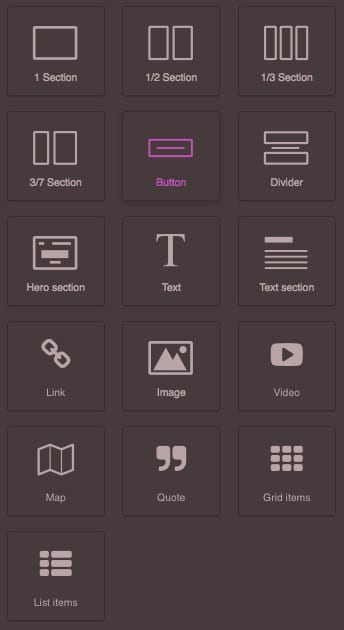
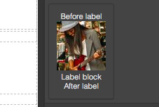
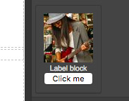

# 块管理器



> 提示

> 建议先阅读[组件](./3.组件.md)，以便更好地理解本篇内容

* 自定义渲染

块是一个[组件](./3.组件.md)的集合，可以很容易地在模板中复用。

组件和块的不同之处在于：组件更加原子化，因此一张图片，一个文本盒子或者一张地图都是一个组件。块由用户拖入画布，它可能包含了一张图片（一个组件）或者是一整块内容，诸如一个包含很多组件（文本，图片，输入框等等）的页脚。

访问[组件](./3.组件.md)页面查看内置组件列表以及如何创建自定义组件。

以下展示了使用[块API](https://grapesjs.com/docs/api/block_manager.html)向编辑器添加新块的方法

```js
var editor = grapesjs.init({...});
var blockManager = editor.BlockManager;

// 'my-first-block' is the ID of the block
blockManager.add('my-first-block', {
  label: 'Simple block',
  content: '<div class="my-block">This is a simple block</div>',
});
```

上述代码将一个新的块添加到块集合中。修改现有块的方法如下

```js
blockManager.get('my-first-block').set({
  label: 'Updated simple block',
  attributes: {
    title: 'My title'
  }
})
```

创建新块只需要一段简单的 HTML 字符串就够了，剩下的工作交给编辑器来完成。如果愿意，可以传入[组件](https://grapesjs.com/docs/api/component.html)定义对象。

```js
blockManager.add('my-map-block', {
  label: 'Simple map block',
  content: {
    type: 'map', // Built-in 'map' component
    style: {
      height: '350px'
    },
    removable: false, // Once inserted it can't be removed
  }
})
```

从 v0.3.70 版本开始，可以传入一段 HTML 字符串，该字符串中可以将组件属性作为 DOM 元素的属性。

```js
blockManager.add('the-row-block', {
  label: '2 Columns',
  content: '<div class="row" data-gjs-droppable=".row-cell" data-gjs-custom-name="Row">' +
      '<div class="row-cell" data-gjs-draggable=".row"></div>' +
      '<div class="row-cell" data-gjs-draggable=".row"></div>' +
    '</div>',
});
```

上例中，定义了一个行组件，该组件中只包含能够匹配'.row-cell'选择器的元素以及只能放置在'.row'元素内部的单元格元素。同时我们也定义了组件的名称，组件名称将会在图层面板中显示。访问组件模型源码查看完整的组件属性列表：[https://github.com/artf/grapesjs/blob/dev/src/dom_components/model/Component.js](https://github.com/artf/grapesjs/blob/dev/src/dom_components/model/Component.js)

## 自定义渲染

想要定制化块的外观，可以在块定义参数中传入```render```回调方法。

首选方式是在回调方法中返回一个 HTML 字符串，该字符创将会作为块的内容渲染。回调方法接收一个包含如下属性的对象：

* ```model``` - 块模型(你可以使用任何传给模型的属性值)
* ```el``` - 当前渲染的块内容
* ```className``` - 块的基本类名 (如果你遵循 BEM 规范这将会很有用，你可以创建形如```${className}__elem```的类）

```js
blockManager.add('some-block-id', {
  label: `<div>
      
      <div class="my-label-block">Label block</div>
    </div>`,
  content: '<div>...</div>',
  render: ({ model, className }) => `<div class="${className}__my-wrap">
      Before label
      ${model.get('label')}
      After label
    </div>`,
});
```



另一个方式是回调函数不做任何返回（此时什么都不会改变），只修改当前的```el```块元素

```js
blockManager.add('some-block-id', {
  // ...
  render: ({ el }) => {
    const btn = document.createElement('button');
    btn.innerHTML = 'Click me';
    btn.addEventListener('click', () => alert('Do something'))
    el.appendChild(btn);
  },
});
```



----

接下来： [命令]()
