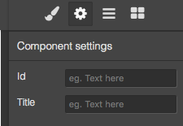
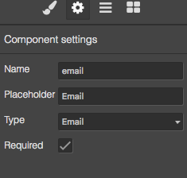
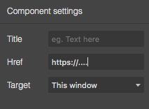
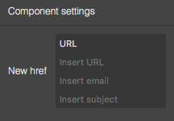
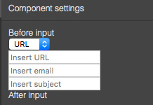

# 特性管理器

在 GrapesJS 中，特性定义了组件不同的参数和行为。通常来说，用户可以将特性视作组件的配置项。特性常用于定制化组件的属性（例如```<input>```元素的```placeholder```属性）或者将特性与组件的属性绑定以便响应特性变更。

> 警告

> 本篇指南基于 GrapesJS v0.15.3 及以上版本

> 建议先阅读[组件](./3.组件.md)章节，有助于更好地理解本篇内容

* [新增组件特性](#新增组件特性)
* [内置特性类型](#内置特性类型)
  * [文本](#文本)
  * [数值](#数值)
  * [复选框](#复选框)
  * [下拉框](#下拉框)
  * [颜色选择器](#颜色选择器)
  * [按钮](#按钮)
* [在运行时修改特性](#在运行时修改特性)
* [定义新特性类型](#定义新特性类型)
  * [新建元素](#新建元素)
  * [修改布局](#修改布局)
  * [绑定到组件](#绑定到组件)
  * [结果](#结果)
  * [集成外部UI组件](#集成外部UI组件)

## 新增组件特性

组件的特性通常在定义新的定制化组件时定义（或者扩展组件时）。以下示例展示了如何使输入框更加定制化。

缺省情况下，所有的组件都有两个特性：id 和标题。因此，当选中一个输入框组件并打开其设置面板时将会看到：



通过以下方式可以新建一个自定义的```input```组件：

```js
editor.DomComponents.addType('input', {
    isComponent: el => el.tagName == 'INPUT',
    model: {
      defaults: {
        traits: [
          // Strings are automatically converted to text types
          'name', // Same as: { type: 'text', name: 'name' }
          'placeholder',
          {
            type: 'select', // Type of the trait
            label: 'Type', // The label you will see in Settings
            name: 'type', // The name of the attribute/property to use on component
            options: [
              { id: 'text', name: 'Text'},
              { id: 'email', name: 'Email'},
              { id: 'password', name: 'Password'},
              { id: 'number', name: 'Number'},
            ]
          }, {
            type: 'checkbox',
            name: 'required',
        }],
        // As by default, traits are binded to attributes, so to define
        // their initial value we can use attributes
        attributes: { type: 'text', required: true },
      },
    },
});
```

其结果如下：



也可以通过函数在组件初始化时动态创建特性。这在需要基于其他组件的特性创建新特性时很有用处。

```js
editor.DomComponents.addType('input', {
    isComponent: el => el.tagName == 'INPUT',
    model: {
      defaults: {
        traits(component) {
          const result = [];

          // Example of some logic
          if (component.get('draggable')) {
            result.push('name');
          } else {
            result.push({
              type: 'select',
              // ....
            });
          }

          return result;
        }
      },
    },
});
```

可以通过监听属性事件的方式来响应特性变更

```js
editor.DomComponents.addType('input', {
  model: {
    defaults: {
      // ...
    },

    init() {
      this.on('change:attributes:type', this.handleTypeChange);
    },

    handleTypeChange() {
      console.log('Input type changed to: ', this.getAttributes().type);
    },
  }
})
```

如前所述，缺省情况下，特性会修改模型上的属性，可以通过```changeProp```选项将特性与属性关联。

```js
editor.DomComponents.addType('input', {
  model: {
    defaults: {
      // ...
      traits: [
        {
          name: 'placeholder',
          changeProp: 1,
        }
        // ...
      ],
      // As we switched from attributes to properties the
      // initial value should be set from the property
      placeholder: 'Initial placeholder',
    },

    init() {
      // Also the listener changes from `change:attributes:*` to `change:*`
      this.on('change:placeholder', this.handlePlhChange);
    },
    // ...
  }
})
```

## 内置特性类型

GrapesJS 提供了内置特性类型

### 文本

基本文本输入框

```js
{
  type: 'text', // If you don't specify the type, the `text` is the default one
  name: 'my-trait', // Required and available for all traits
  label: 'My trait', // The label you will see near the input
  // label: false, // If you set label to `false`, the label column will be removed
  placeholder: 'Insert text', // Placeholder to show inside the input
}
```

### 数值

数值输入框

```js
{
  type: 'number',
  // ...
  placeholder: '0-100',
  min: 0, // Minimum number value
  max: 100, // Maximum number value
  step: 5, // Number of steps
}
```

### 复选框

基本复选框

```js
{
  type: 'checkbox',
  // ...
  valueTrue: 'YES', // Value to assign when is checked, default: `true`
  valueFalse: 'NO', // Value to assign when is unchecked, default: `false`
}
```

### 下拉框

带选项的下拉框

```js
{
  type: 'select',
  // ...
  options: [ // Array of options
    { id: 'opt1', name: 'Option 1'},
    { id: 'opt2', name: 'Option 2'},
  ]
}
```

### 颜色选择器

颜色选择器

```js
{
  type: 'color',
  // ...
}
```

### 按钮

绑定了命令的按钮

```js
{
  type: 'button',
  // ...
  text: 'Click me',
  full: true, // Full width button
  command: editor => alert('Hello'),
  // or you can just specify the Command ID
  command: 'some-command',

}
```

## 在运行时修改特性

如果你需要修改组件上的特性值，你可以随时调用[组件API](https://grapesjs.com/docs/api/component.html)来修改它。

特性是组件上定义的简单属性，因此你可以通过如下调用查看支持完整特性列表

```js
const component = editor.getSelected(); // Component selected in canvas
const traits = component.get('traits');
traits.forEach(trait => console.log(trait.props()))
```

需要获取指定特性时

```js
const component = editor.getSelected();
console.log(component.getTrait('type').props()); // Finds by the `name` of the trait
```

通过以下方式修改特性值

```js
// Let's update `options` of our `type` trait, defined in Input component
const component = editor.getSelected();
component.getTrait('type').set('options', [
  { id: 'opt1', name: 'New option 1'},
  { id: 'opt2', name: 'New option 2'},
]);
// or with multiple values
component.getTrait('type').set({
  label: 'My type',
  options: [...],
});
```

使用```addTrait/removeTrait```新增和删除特性

```js
// Add new trait
const component = editor.getSelected();
component.addTrait({
  name: 'type',
  ...
}, { at: 0 });
// The `at` option indicates the index where to place the new trait,
// without it, the trait will be appended at the end of the list

// Remove trait
component.removeTrait('type');
```

## 定义新特性类型

通常大多数情况下，缺省的特性类型已经足够了，但有时缺省特性并不能满足所有需求。此时，可以创建一个全新的特性类型，将任意类型的组件与其绑定。

### 新建元素

让我们为```链接（link）```组件新增一个特性类型。缺省情况下，链接组件的有如下特性。



使用新增的```href-text```特性替换掉全部原有特性，这样用户可以选择超链接的类型（如'url','email'等等）

```js
// Update component
editor.DomComponents.addType('link', {
  model: {
    defaults: {
      traits: [
        {
          type: 'href-next',
          name: 'href',
          label: 'New href',
        },
      ]
    }
  }
});
```

现在看到的仍然会是缺省的链接组件特性，因为我们还没有定义新的特性类型。示例如下：

```js
editor.TraitManager.addType('href-next', {
  // Expects as return a simple HTML string or an HTML element
  createInput({ trait }) {
    // Here we can decide to use properties from the trait
    const traitOpts = trait.get('options') || [];
    const options = traitOpts.length ? traitOpts : [
      { id: 'url', name: 'URL' },
      { id: 'email', name: 'Email' },
    ];

    // Create a new element container and add some content
    const el = document.createElement('div');
    el.innerHTML = `
      <select class="href-next__type">
        ${options.map(opt => `<option value="${opt.id}">${opt.name}</option>`).join('')}
      </select>
      <div class="href-next__url-inputs">
        <input class="href-next__url" placeholder="Insert URL"/>
      </div>
      <div class="href-next__email-inputs">
        <input class="href-next__email" placeholder="Insert email"/>
        <input class="href-next__email-subject" placeholder="Insert subject"/>
      </div>
    `;

    // Let's make our content interactive
    const inputsUrl = el.querySelector('.href-next__url-inputs');
    const inputsEmail = el.querySelector('.href-next__email-inputs');
    const inputType = el.querySelector('.href-next__type');
    inputType.addEventListener('change', ev => {
      switch (ev.target.value) {
        case 'url':
          inputsUrl.style.display = '';
          inputsEmail.style.display = 'none';
          break;
        case 'email':
          inputsUrl.style.display = 'none';
          inputsEmail.style.display = '';
          break;
      }
    });

    return el;
  },
});
```

上例中我们新建了自定义输入框（同时使用了```option```类型的特性），自定义输入框会根据选择的超链接类型不同而执行不同的行为。结果如下。



### 修改布局

在完成特性定义前，我们先来介绍特性的布局结构。你可能已经注意到，特性是由标题和输入框两列组成，因此，在 GrapesJS 中你可以改变这两个列的展示。

可以调用```createLabel```来完成标题的定制化

```js
editor.TraitManager.addType('href-next', {
  // Expects as return a simple HTML string or an HTML element
  createLabel({ label }) {
    return `<div>
      <div>Before</div>
      ${label}
      <div>After</div>
    </div>`;
  },
  // ...
});
```

你可能已经注意到你可以在为组件定义特性时传入```label: false```来去掉标题列。当需要在所有特性实例上强制去掉标题列时，可以传入```noLabel: true```

```js
editor.TraitManager.addType('href-next', {
  noLabel: true,
  // ...
});
```

缺省情况下，GrapesJS 会在输入框父级放置一个包装器，对于基本输入框来说通常没什么问题，但是当创建复杂特性时，就可能会出问题。可以使用```templateInput```选项来去掉缺省的包装器

```js
editor.TraitManager.addType('href-next', {
  // Completely remove the wrapper
  templateInput: '',
  // Use a new one, by specifying with `data-input` attribute where to place the input container
  templateInput: `<div class="custom-input-wrapper">
    Before input
    <div data-input></div>
    After input
  </div>`,
  // It might also be a function, expects an HTML string as the result
  templateInput({ trait }) {
    return '<div ...';
  },
});
```



此时，展示的结果非常不美观，但是自定义特性类型支持重用样式美化过的输入框。现在，让我们保留缺省的输入框包装器，继续完成自定义特性的定义。

### 绑定到组件

当前状态下，在```createInput```方法中创建的元素还没有绑定到组件上，所以看不到任何变化。下面展示了如何将特性绑定到组件。

```js
editor.TraitManager.addType('href-next', {
  // ...

  // Update the component based on element changes
  // `elInput` is the result HTMLElement you get from `createInput`
  onEvent({ elInput, component, event }) {
    const inputType = elInput.querySelector('.href-next__type');
    let href = '';

    switch (inputType.value) {
      case 'url':
        const valUrl = elInput.querySelector('.href-next__url').value;
        href = valUrl;
        break;
      case 'email':
        const valEmail = elInput.querySelector('.href-next__email').value;
        const valSubj = elInput.querySelector('.href-next__email-subject').value;
        href = `mailto:${valEmail}${valSubj ? `?subject=${valSubj}` : ''}`;
        break;
    }

    component.addAttributes({ href })
  },
});
```

现在为止，大部分的工作已经完成（你可以修改特性值然后在预览代码时查看 HTML）。你也许会好奇编辑器如何捕捉到输入框的变动以及如何控制这种变动。缺省情况下，基础特性包装器会监听```change```事件并在捕捉到事件时调用```onEvent```方法（[需要在开启事件冒泡的情况下才能捕捉到事件](https://stackoverflow.com/questions/4616694/what-is-event-bubbling-and-capturing)）。如果你想在捕捉到```input```事件时修改组件，你可以修改```eventCapture```属性。

```js
editor.TraitManager.addType('href-next', {
  eventCapture: ['input'], // you can use multiple events in the array
  // ...
});
```

最后，你可能已经注意到错误的特性初始化渲染，虽然已经定义了```href```属性输入框仍然没有填入任何文本内容。此时需要在```onUpdate```方法中完整最后的工作。

```js
editor.TraitManager.addType('href-next', {
  // ...

  // Update elements on the component change
  onUpdate({ elInput, component }) {
    const href = component.getAttributes().href || '';
    const inputType = elInput.querySelector('.href-next__type');
    let type = 'url';

    if (href.indexOf('mailto:') === 0) {
      const inputEmail = elInput.querySelector('.href-next__email');
      const inputSubject = elInput.querySelector('.href-next__email-subject');
      const mailTo = href.replace('mailto:', '').split('?');
      const email = mailTo[0];
      const params = (mailTo[1] || '').split('&').reduce((acc, item) => {
        const items = item.split('=');
        acc[items[0]] = items[1];
        return acc;
      }, {});
      type = 'email';

      inputEmail.value = email || '';
      inputSubject.value = params.subject || '';
    } else {
      elInput.querySelector('.href-next__url').value = href;
    }

    inputType.value = type;
    inputType.dispatchEvent(new CustomEvent('change'));
  },
});
```

现在特性就会在组件有变更时更新：

```js
editor.getSelected().addAttributes({ href: 'mailto:new-email@test.com?subject=NewSubject' })
```

回顾一下整个过程, 创建新的自定义特性类型需要用到3个方法：

* createInput - 定义特性的 HTML DOM
* onEvent - 定义输入框发生改变时如何更新组件
* onUpdate - 定义组件发生改变时如何更新输入框

### 结果

[完整的示例](https://jsfiddle.net/artur_arseniev/yf6amdqb/10/)

### 集成外部UI组件

上述示例中看起来有大量代码，但是最终只实现了一个很简单的逻辑，而且调用原生的 DOM API 并不优雅。如果你用过现代 UI 客户端框架（比如 Vue，React 等等）你就会发现集成这些框架来实现上述逻辑会更加简单。以下展示了如何将一个自定义的 [Vue 实现的滑块组件](https://github.com/NightCatSama/vue-slider-component) 集成到框架中。

```js
editor.TraitManager.addType('slider', {
  createInput({ trait }) {
    const vueInst = new Vue({ render: h => h(VueSlider) }).$mount();
    const sliderInst = vueInst.$children[0];
    sliderInst.$on('change', ev => this.onChange(ev)); // Use onChange to trigger onEvent
    this.sliderInst = sliderInst;
    return vueInst.$el;
  },

  onEvent({ component }) {
    const value = this.sliderInst.getValue() || 0;
    component.addAttributes({ value });
  },

  onUpdate({ component }) {
    const value = component.getAttributes().value || 0;
    this.sliderInst.setValue(value);
  },
});
```

[完整示例](https://jsfiddle.net/artur_arseniev/x9sw2udv/79/)

集成外部组件有以下要点：

* 组件渲染：```new Vue({ render: ...```

  因框架而已，例如在 React 中使用的是 ```ReactDOM.render(element, ...```

* 修改事件监听：```sliderInst.$on('change', ev => this.onChange(ev))```

  框架应该具备机制以便开发者可以监听变化并且[组件能够暴露出变化](https://nightcatsama.github.io/vue-slider-component/#/api/events)

  我们使用了```onChanged```方法，当你需要手动触发```onEvent```事件时很方便（不建议直接调用```onEvent```方法，只在需要时使用```onChange```）。

* 属性的获取器和设置器：[```sliderInst.getValue()```](https://nightcatsama.github.io/vue-slider-component/#/api/methods?hash=getvalue) / [```sliderInst.setValue(value)```](https://nightcatsama.github.io/vue-slider-component/#/api/methods?hash=setvaluevalue)

  组件应该支持实例数据的读取和写入

----

接下来： [样式管理器](./9.样式管理器.md)