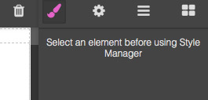

# 国际化

I18n 模块提供了国际化功能并且更新编辑器页面上的字符串

> 警告

> 本篇内容基于 GrapesJS v0.15.9 或更高版本

* [配置](#配置)
* [更新字符串](#更新字符串)
  * [生成字符串](#生成字符串)
* [新增一种语言](#新增一种语言)
* [插件开发](#插件开发)

## 配置

缺省情况下，编辑器只有英语，如果需要其他语种，可以手动引入。注意：语言编码遵循 [ISO 639-1](https://en.wikipedia.org/wiki/List_of_ISO_639-1_codes) 标准。

```js
import grapesjs from 'grapesjs';
import it from 'grapesjs/locale/it';
import tr from 'grapesjs/locale/tr';

const editor = grapesjs.init({
  ...
  i18n: {
    // locale: 'en', // default locale
    // detectLocale: true, // by default, the editor will detect the language
    // localeFallback: 'en', // default fallback
    messages: { it, tr },
  }
});
```

现在编辑器页面在默认语言是意大利语的浏览器上就会显示意大利语（缺省情况下```detectLocale```选项开启）。

## 更新字符串

如果需要改变缺省语言字符串，可以使用 [I18n API](https://grapesjs.com/docs/api/i18n.html) 进行更新。查看```en```[语言文件](https://github.com/artf/grapesjs/blob/master/src/i18n/locale/en.js)找到正确的语言路径。

假设我们要修改在没有选中任何元素时样式管理器中缺省的空白提示消息。



在```en```语言文件中找到下列引用路径

```js
{
    ...
    styleManager: {
        empty: 'Select an element before using Style Manager',
        ...
    },
    ...
}
```

可以这样更新提示消息

```js
editor.I18n.addMessages({
    en: { // indicate the locale to update
        styleManager: {
            empty: 'New empty state message',
        }
    }
});
```

强烈建议使用插件来封装上述代码

```js
const myPlugin = editor => {
    editor.I18n.addMessages({ ... });
    // ...
}

grapesjs.init({
  // ...
  plugins: [myPlugin],
});
```

## 生成的字符串

```en```本地化文件中并没有列出全部的字符串，因为有些字符串是通过```id```，```name```等等生成的。回顾```en```文件中的```styleManager```属性会看到一个属性名是```properties```的空对象。

```js
...
styleManager: {
    ...
    properties: {
        // float: 'Float',
    },
    ...
},
...
```

这个对象是用来翻译样式管理器中的属性名称的，所以，如果想要修改```margin```属性中自动生成的文案


可以这样实现

```js
editor.I18n.addMessages({
    en: {
        styleManager: {
            properties: {
                // The key is the property name (or id)
                'margin-top': 'Top',
                'margin-right': 'Right',
                'margin-left': 'Left',
                'margin-bottom': 'Bottom',
            },
        }
    }
});
```

## 新增语言

想要在 GrapesJS 中新增一种语言，需要遵循以下步骤：

1、首先，确认[```src/i18n/locale```](https://github.com/artf/grapesjs/tree/master/src/i18n/locale) 未定义该种语言

2、[新建一个issue](https://github.com/artf/grapesjs/issues/new?title=XX%20Language%20support)，避免与其他代码提交者重复。确认没有其他人也创建了同种语言新增的issue。

3、基于```dev```分支新建分支

4、复制（同文件夹下）并重命名[```en```本地化文件]（https://github.com/artf/grapesjs/blob/master/src/i18n/locale/en.js），以待新增的语言命名（遵循 [ISO 639-1](https://en.wikipedia.org/wiki/List_of_ISO_639-1_codes)标准)。

5、翻译字符串

6、部分属性并未定义其值（例如```styleManager.properties```），可以查看其他本地化文件找到相关引用

7、完成上述步骤，在 GitHub 上提交一个从你的分支到```dev```分支的合入请求，附带相关issue的引用，以便于在合入时自动关闭该issue（PR信息中应该包含```Close #1234```，1234即为 issue 的 ID）

## 插件开发

如果你正在开发 GrapesJS 插件，你需要提供字符串本地化或者修改缺省配置。

```
plugin-dir
- package.json
- README.md
- ...
- src
    - index.js
    - locale // create the locale foldar in your src
        - en.js // All default strings should be placed here
```

将插件定义的字符串放置在插件名后面的参数对象中。

```js
// src/locale/en.js
export default {
    'grapesjs-plugin-name': {
        yourKey: 'Your value',
    }
}
```

在```index.js```中，引入```en.js```文件，将 i18n 配置导入

```js
// src/index.js
import en from 'locale/en';

export default (editor, opts = {}) => {
    const options = {
        i18n: {},
        // ...
        ...opts,
    };

    // ...

    editor.I18n.addMessages({
        en,
        ...options.i18n,
    });
}
```

下面编译你的本地化文件，将其放入```<rootDir>/locale```文件夹，便于用户访问。

最后，你的插件用户可以通过以下方式引入本地化文件

```js
import grapesjs from 'grapesjs';

// Import from your plugin
import yourPlugin from 'grapesjs-your-plugin';
import ch from 'grapesjs-your-plugin/locale/ch';
import fr from 'grapesjs-your-plugin/locale/fr';

const editor = grapesjs.init({
  ...
  plugins: [ yourPlugin ],
  pluginsOpts: {
      [yourPlugin]: {
          i18n: { ch, fr }
      }
  }
});
```

----

接下来： [特性](./6.特性.md)
